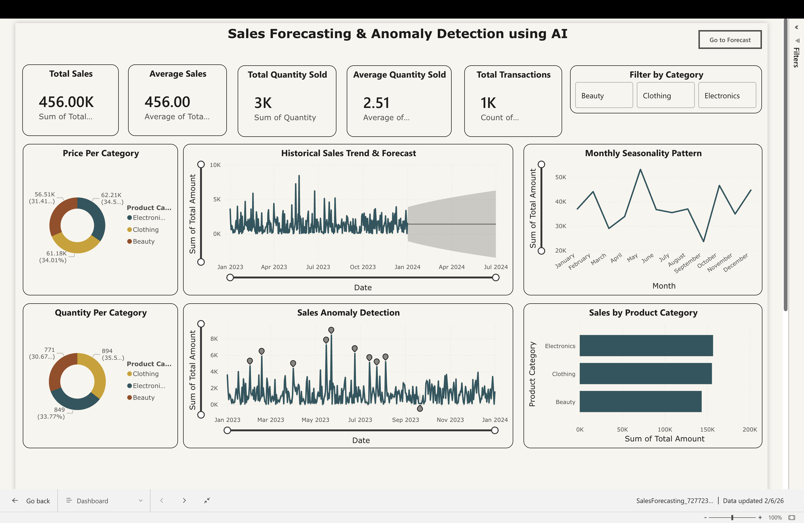
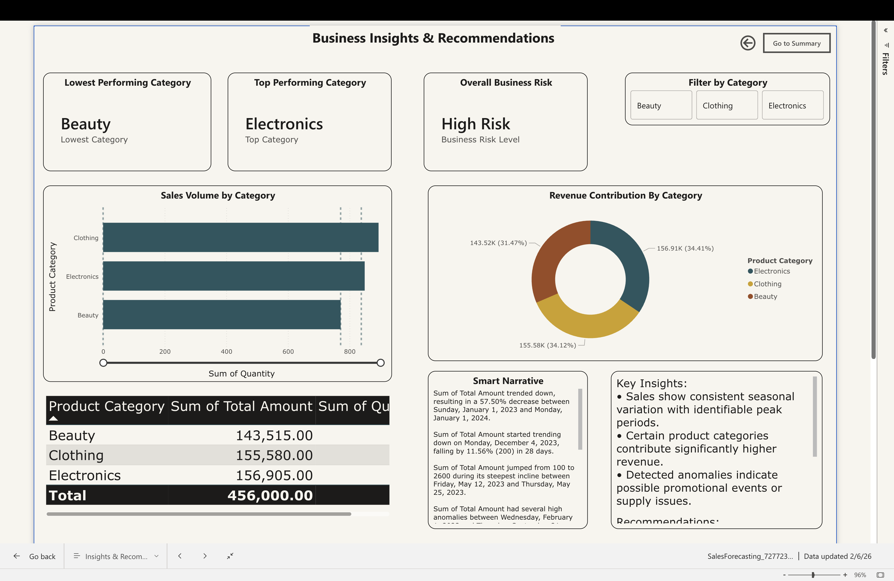
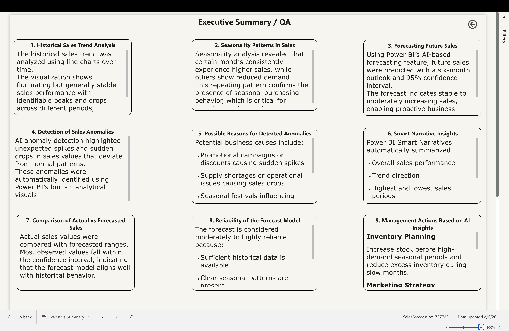

# AI Sales Forecasting & Anomaly Detection (Power BI)

## Problem Statement
Retail organization wants predictive analytics instead of reactive reporting.

## Objectives
- Forecast future sales
- Detect anomalies
- Generate AI insights

## Tools Used
- Power BI
- AI Forecasting
- Smart Narratives

## Dashboard Pages
1. Overview Dashboard
2. Forecast Analysis
3. Insights & Recommendations
4. Executive Summary

## Key Results
- Seasonal sales patterns identified
- Reliable 6-month forecast generated
- Business risks detected using AI

## How to Run
Download the `.pbix` file from /powerbi and open in Power BI Desktop.

## Dashboard Screenshots

### Overview Dashboard

### Forecast Analysis

### Insights & Recommendations

### Executive Summary

